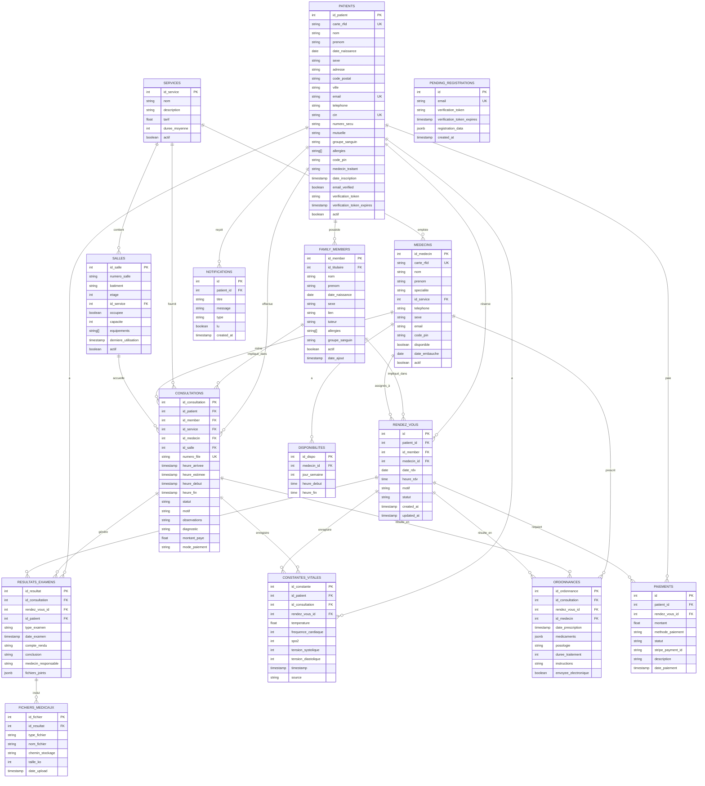

# Diagramme UML / ER de la Base de Données

Voici le diagramme Entité-Relation basé sur le schéma de votre base de données (`initDatabase.js`). Ce diagramme montre les tables principales et leurs relations.

